✦ [About](#about) · [Where Tnega was born](#born) · [Building now](#building) · [Projects](#projects) · [Tech stack](#stack) · [Learning](#learning) · [Say hi](#contact) ✦

I build tools that make on-chain things **measurable and verifiable**: what a tokenized stock really costs to buy, whether an AI agent does what it says, whether a credential or a receipt can be trusted.

I started as a **structural engineer**, moved to Lisbon, and finished an **MSc in Business at Católica Lisbon**. Today I'm the solo founder of **[Tnega](https://www.tnega.app)**, and Fendi, the cat in the picture, is its mascot.

Tnega did not start from nothing. It began at the **University of Zurich's Deep Dive Into Blockchain** summer school, as **F2F Cross-Border & OnChain Oversight**, and Tnega is the next chapter of that same project.

**[Tnega](https://www.tnega.app)** shows what every tokenized stock and ETF costs to buy on every chain. Orders are prepared for you and **signed in your own wallet**: Tnega never holds keys or funds. AI assistants can use it through MCP tools, and an open measurement layer covers on-chain agents.

<table>
<tr>
<td></td>
<td></td>
</tr>
<tr>
<td></td>
<td></td>
</tr>
<tr>
<td colspan="2" align="center"></td>
</tr>
</table>

- ✦ **Solana Fall School**: PDAs, CPI, LiteSVM and the Anchor constraint system
- ✦ **Deep Dive Into Blockchain**, University of Zurich, 2026
- ✦ **Google for Startups Immersion EMEA**, powered by Antler

